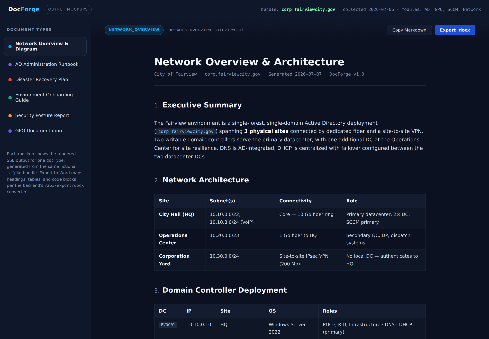
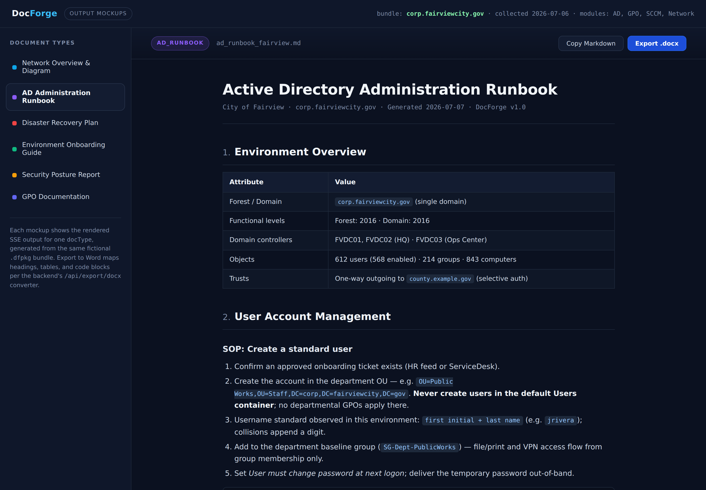
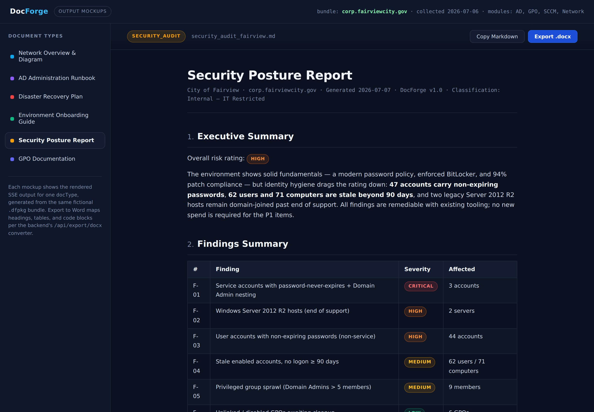
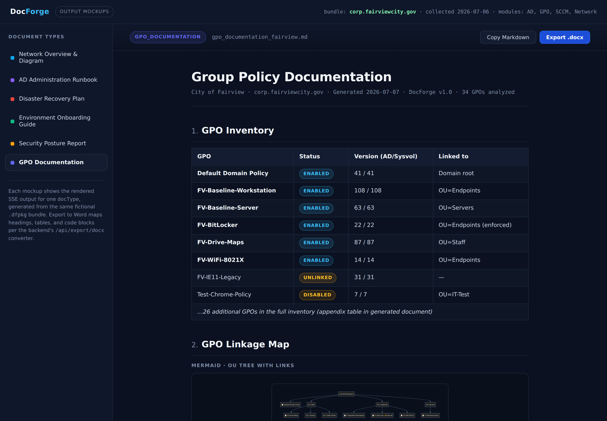

# DocForge — Output Mockups

Visual reference for what DocForge generates from a `Collect-ITEnvironment.ps1` bundle. Every screenshot below was rendered from the **same fictional environment** — *City of Fairview* (`corp.fairviewcity.gov`, 3 sites, 3 DCs, MECM site `FV1`, 612 users / 843 computers) — so you can see how one `.dfpkg` fans out into six different document types.

No real environment data appears in these mockups.

> **How to read these:** each page is the rendered result of one `POST /api/generate` call with a different `docType`. The backend's smart segmentation (`segmentData()`) filters the bundle down to only the fields that doc type needs before the request goes to the Claude API, and the SSE stream renders token-by-token in the viewer. Any document can then be exported to Word via `POST /api/export/docx`.

---

## Contents

| # | Document type | `docType` | Primary data sources |
|---|---|---|---|
| 1 | [Network Overview & Diagram](#1-network-overview--diagram) | `network_overview` | AD sites/DCs, DNS, DHCP, adapters, routes |
| 2 | [AD Administration Runbook](#2-ad-administration-runbook) | `ad_runbook` | AD (summarized), GPO summary |
| 3 | [Disaster Recovery Plan](#3-disaster-recovery-plan) | `disaster_recovery` | DCs, sites, DNS/DHCP, SCCM site + device counts |
| 4 | [Environment Onboarding Guide](#4-environment-onboarding-guide) | `onboarding` | AD (summarized), GPO, network, SCCM site |
| 5 | [Security Posture Report](#5-security-posture-report) | `security_audit` | Full user/computer stats, password policies, privileged groups, firewall, SCCM patch/BitLocker |
| 6 | [GPO Documentation](#6-gpo-documentation) | `gpo_documentation` | Full GPO module, OU structure |

---

## 1. Network Overview & Diagram



**Purpose:** the "what does this network actually look like" document — the one you hand to a new engineer, an auditor, or a consultant on day one.

**What the generator produces:**

- **Executive summary** sized for non-technical readers (2–3 sentences).
- **Site/subnet/connectivity table** built from AD Sites & Services plus adapter/route data.
- **Domain controller deployment table** — every DC with IP, site, OS, and FSMO/DNS/DHCP roles.
- **DNS & DHCP infrastructure** with per-scope utilization pulled from the collector's DHCP statistics. Note the flagged 91% scope — real numbers from the bundle, not boilerplate.
- **Replication topology** narrative (site links, costs, intervals).
- **Live Mermaid topology diagram** (below) — emitted as a fenced ` ```mermaid ` block, rendered client-side in the viewer and preserved as a code block in the Word export.
- **Recommendations** ranked by severity, derived from issues the model spots in the data (SPOF sites, public DNS forwarders, OS version skew).


*The diagram groups nodes by physical site, labels replication links with interval, and distinguishes fiber (solid) from VPN (dashed) connectivity — all inferred from the bundle.*

---

## 2. AD Administration Runbook



**Purpose:** operational SOPs that reference the **actual** environment — real OU paths, the real naming convention, the real password policy — instead of generic Microsoft docs.

**What the generator produces:**

- **Environment overview table** (forest/domain, functional levels, object counts, trusts).
- **User lifecycle SOPs** (create / disable / delete) with ready-to-run PowerShell that uses the environment's own DN paths and group names.
- **Group naming convention table** — inferred from the prefixes observed in the bundle (`SG-`, `DL-`, `PRV-`, `APP-`), so the runbook enforces what the environment already practices.
- **Password policy reference** — Default Domain Policy and any fine-grained policies, with actual values.
- **DC maintenance section** — weekly health-check commands, FSMO reference, and transfer vs. seize guidance.
- **Break-glass procedures** rendered as a high-visibility callout.
- **Appendix of key distinguished names** for copy/paste.

---

## 3. Disaster Recovery Plan


**Purpose:** an identity-and-core-services DR plan grounded in the real topology — the RTO/RPO table and the risk register come from what the collector actually found, not a template.

**What the generator produces:**

- **RTO/RPO table per service** with the *basis* column explaining why each target is achievable (e.g., "multi-DC replication interval").
- **Critical infrastructure inventory** including backup targets.
- **Risk assessment** — single points of failure detected in the data (all FSMO roles in one building, a DC-less site, single MECM primary), each with a severity badge.
- **Five recovery scenarios** as numbered procedures: single DC failure, complete site loss, AD database corruption, DNS/DHCP failure, inter-site connectivity loss.
- **Backup requirements** with a met / not-met assessment against what the bundle shows.
- **Communication plan template** and a **testing schedule** (quarterly / semi-annual / annual).
- **Mermaid failover diagram** showing the recovery path when the primary site is lost.

---

## 4. Environment Onboarding Guide


**Purpose:** the new-hire document — same underlying data as the runbook, but a friendlier register, "if it's down…" columns, and quick-reference tables instead of formal SOPs.

**What the generator produces:**

- **Welcome overview** with environment scale in plain language.
- **Architecture-at-a-glance Mermaid diagram** (you → AD → sites → MECM → endpoints).
- **Key infrastructure table** with a distinctive *"If it's down…"* column telling a new tech what actually breaks.
- **AD structure and group-prefix decoder** so a new hire can read the directory.
- **GPO overview** limited to the policies they'll actually touch.
- **Common tasks quick reference** — password resets, reimaging, app deployment, share-access tracing, patch status.
- **Security policies you must know** and an **escalation/contacts table**.

This doc type demonstrates the value of per-type prompting: identical data, completely different audience and tone.

---

## 5. Security Posture Report



**Purpose:** a risk-rated audit deliverable. This is the doc type that leans hardest on the collector's numeric fields (`stale_90_days`, `password_never_expires_count`, privileged-group membership, firewall rules, patch compliance).

**What the generator produces:**

- **Overall risk rating** (Critical/High/Medium/Low) with a defensible executive summary.
- **Findings summary table** — numbered findings with color-coded severity badges and affected counts (below).
- **Detailed findings** using actual numbers from the bundle ("password age 1,847 days"), each with an indented remediation note.
- **Compliance gap table** mapping every finding to **NIST 800-53** control IDs and **CIS Benchmark / Controls** references.
- **Prioritized remediation roadmap** in phases (≤2 weeks / ≤30 days / ≤90 days) with effort estimates and owners.
- **Verification callout** — re-run the collector after each phase and regenerate the report; the finding deltas become the evidence trail.


*Severity badges (Critical / High / Medium / Low) are rendered by the viewer from plain Markdown; the Word exporter carries them as styled table cells.*

> **Handling note:** generated security reports contain sensitive environment detail. Treat the output as restricted (the mockup carries an `Internal — IT Restricted` classification line in its metadata for this reason).

---

## 6. GPO Documentation



**Purpose:** the living GPO reference nobody ever keeps current by hand — inventory, linkage map, cleanup candidates, and precedence analysis, regenerated on demand.

**What the generator produces:**

- **GPO inventory table** with status, AD/Sysvol version pair (mismatches would be flagged), and link targets.
- **Mermaid OU-tree linkage map** showing where every active GPO is linked, with enforced links marked.
- **Policy categories** breakdown (security / configuration / software deployment / dead).
- **Unlinked & disabled policy table** with last-modified dates and a per-GPO recommendation — the cleanup review, pre-written.
- **WMI filters in use** with their queries and consuming GPOs.
- **Policy precedence notes** — conflicts surfaced as a risk callout, stating explicitly *which policy wins* under LSDOU and whether the conflict appears intentional.
- **Settings summary** of the key configurations found by the collector's parsed-settings module.
- **Change management template** as a fill-in code block, ready to standardize on.

---

## Reproducing these mockups

The screenshots come from [`docforge-output-mockups.html`](docforge-output-mockups.html) — a self-contained, dependency-light HTML file (Mermaid via CDN) that renders all six sample documents with the app's viewer styling. Open it in a browser and click through the left rail. It doubles as:

- a **design reference** when adjusting the frontend's Markdown renderer, and
- a source of **golden-sample structure** for the six prompts in `docforge-v6.jsx` — each mockup follows its prompt's section list exactly.

Screenshots were captured at 1440×1000 (2× DPR) with headless Chromium.
