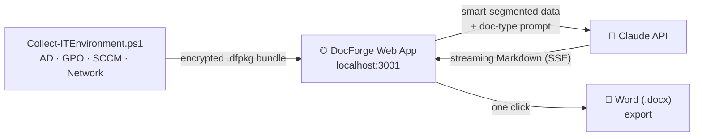
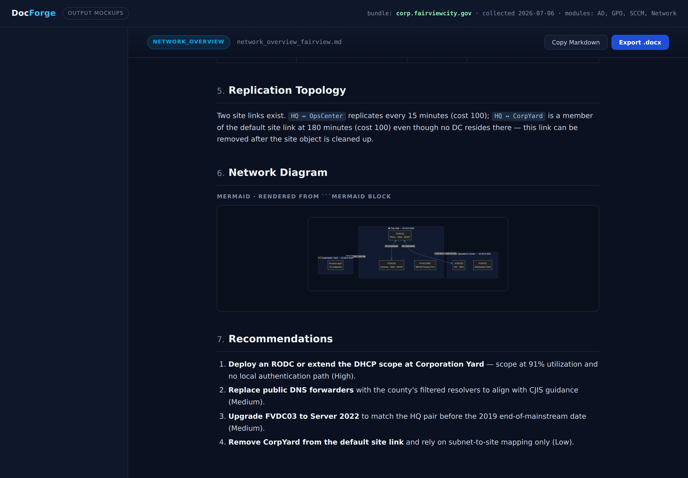
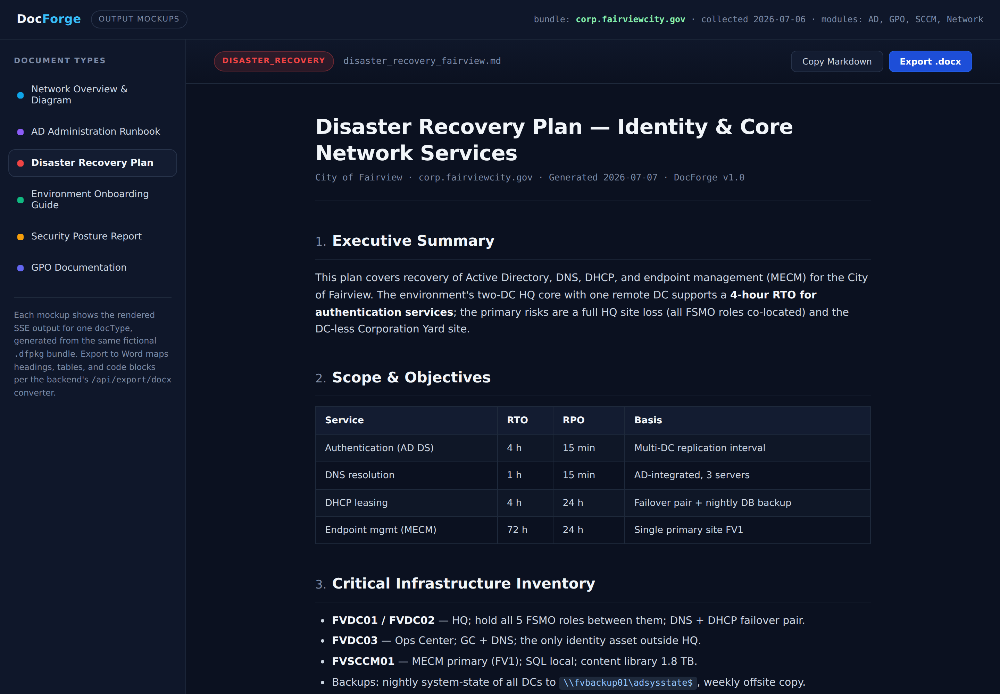
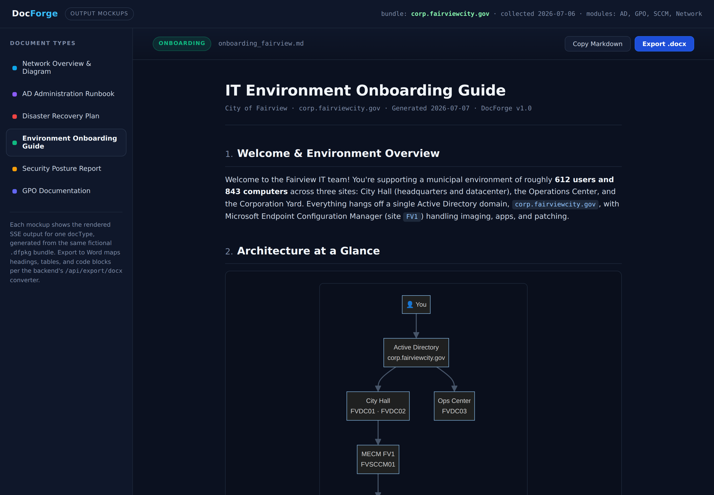
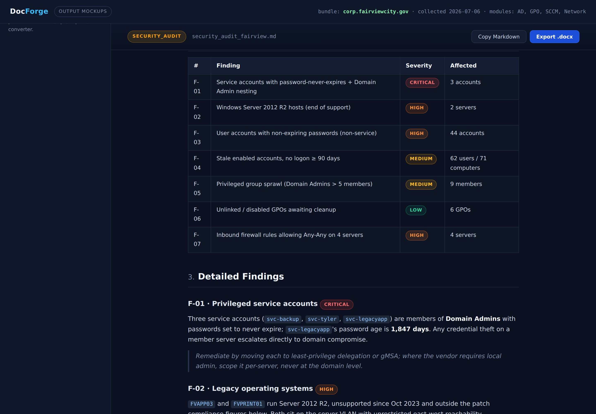

<div align="center">

# DocForge

**Turn raw IT environment data into polished, professional documentation — in minutes, not weeks.**

Point a single PowerShell script at your on-prem environment, drop the bundle into DocForge, and watch Claude stream out network overviews, AD runbooks, DR plans, security audits, and GPO documentation built from **your actual data**.

[](https://nodejs.org)
[](#-step-1--collect-your-environment)
[](https://console.anthropic.com)
[](../LICENSE)


*A generated Network Overview — sites, DCs, DNS/DHCP, and a live topology diagram, all from collected data.*

</div>

---

## The problem

Every IT shop has the same documentation gap: the network diagram is three years old, the AD runbook lives in someone's head, and the DR plan was written for infrastructure that no longer exists. Writing this documentation by hand takes weeks, and it's stale the moment it's finished.

**DocForge closes the gap by generating documentation from live environment data** — so regenerating it is a re-run, not a rewrite.

## How it works



1. **Collect** — run one PowerShell script on a domain-joined machine. It inventories Active Directory, Group Policy (with *parsed* settings, not raw report blobs), SCCM/MECM, and network configuration in parallel, then packages everything as an AES-256 encrypted `.dfpkg` bundle.
2. **Generate** — upload the bundle, pick a document type, and DocForge streams the finished document token-by-token. Only the data relevant to that doc type is sent (smart segmentation), keeping requests small and output focused.
3. **Export** — download as a formatted Word document with proper heading styles, tables, and code blocks.

---

## The six document types

One bundle in, six deliverables out. Every screenshot below was generated from the **same fictional environment** (*City of Fairview* — no real data appears in these mockups).

### Network Overview & Diagram

Sites, subnets, DC deployment, DNS/DHCP with **per-scope utilization**, replication topology, and a Mermaid network diagram — plus severity-ranked recommendations for issues found in the data (SPOF sites, public forwarders, OS skew).



### AD Administration Runbook

Operational SOPs that reference the **actual environment** — real OU paths, the observed group naming convention, the real password policy — with ready-to-run PowerShell, FSMO transfer/seize guidance, and break-glass procedures.


### Disaster Recovery Plan

RTO/RPO targets grounded in the real topology, a risk register of single points of failure **detected in the bundle**, five recovery scenarios as step-by-step procedures, backup gap assessment, and a failover diagram.



### Environment Onboarding Guide

The new-hire document: same data as the runbook, friendlier register. Key infrastructure with an *"If it's down…"* column, a group-prefix decoder, and a common-tasks quick reference.



### Security Posture Report

A risk-rated audit deliverable using **actual numbers** from the collector — stale accounts, non-expiring passwords, privileged-group sprawl, legacy OS, firewall exposure — mapped to **NIST 800-53** and **CIS** controls, with a phased remediation roadmap.



### GPO Documentation

Full GPO inventory with link targets, a Mermaid OU-tree linkage map, unlinked/disabled policy cleanup review, WMI filters, and **LSDOU precedence-conflict analysis** that states which policy wins and why.


> **Want more detail?** See **[docs/MOCKUPS.md](docs/MOCKUPS.md)** for a full breakdown of every page, or open **[docs/docforge-output-mockups.html](docs/docforge-output-mockups.html)** locally to click through all six rendered documents interactively.

---

## ⚡ Quick start

### Step 1 — Collect your environment

Run as a domain account with read access to AD/GPO/SCCM (RSAT and the ConfigMgr console are used where present):

```powershell
# Full collection, encrypted bundle
.\Collect-ITEnvironment.ps1 -Passphrase (Read-Host -AsSecureString) -OutputPath C:\Collections

# Scoped dev collection, plain JSON
.\Collect-ITEnvironment.ps1 -Modules AD,GPO -SkipEncryption
```

Modules run in parallel via a RunspacePool with per-item retry and error capture — one broken subsystem degrades the bundle instead of killing the run.

### Step 2 — Launch DocForge

**Windows one-click:** double-click **`Start-DocForge.bat`** — it checks Node, installs dependencies on first run, starts the server, and opens `http://localhost:3001`.

**Manual:**

```bash
cd docforge-backend
npm install
cp .env.example .env     # add ANTHROPIC_API_KEY=sk-ant-...
npm start                # → http://localhost:3001
```

### Step 3 — Generate

Drop in your `.dfpkg` (or two — the frontend **auto-merges** split collections, e.g. AD-only + SCCM-only), pick a document type, and export to Word when the stream finishes.

---

## 🏗️ What's in this directory

| Path | Role |
|---|---|
| [`Collect-ITEnvironment.ps1`](Collect-ITEnvironment.ps1) | The data collector — AD, GPO, SCCM, network → encrypted `.dfpkg` ([docs](Collect-ITEnvironment.md)) |
| [`docforge-v6.jsx`](docforge-v6.jsx) | React frontend — streaming viewer, doc-type prompts, smart segmentation, auto-merge |
| [`docforge-backend/`](docforge-backend/) | Node 18+ Express backend — upload handling, SSE proxy to the Claude API, `.docx` export ([API reference](docforge-backend/README.md)) |
| [`Start-DocForge.bat`](Start-DocForge.bat) | One-click Windows launcher |
| [`docs/`](docs/) | Output mockups: [`MOCKUPS.md`](docs/MOCKUPS.md), screenshots, and the interactive HTML gallery |

## Security by design

- **API key never reaches the browser** — it lives server-side in `.env`; the frontend talks only to the local backend.
- **Bundles are encrypted at rest** — AES-256-CBC with a PBKDF2-derived key from a `SecureString` passphrase (`-SkipEncryption` exists for development only).
- **Smart segmentation minimizes exposure** — each request sends only the fields the selected document type needs.
- **Generated security reports are sensitive** — they describe your real weaknesses. Treat the output as restricted.

---

<div align="center">

**DocForge** · IT documentation that regenerates itself

*Collect once → generate six documents → re-collect → diff the findings.*

</div>
